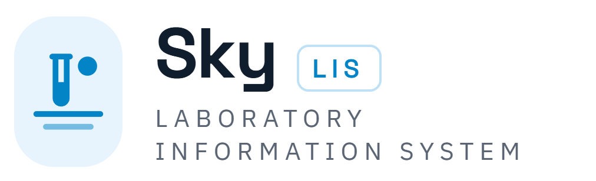

<p align="center">
  
</p>

<h3 align="center">Every result, precisely placed.</h3>

<p align="center">
  Cloud-native, multi-tenant SaaS Laboratory Information System —<br>
  from specimen to signed report, with an immutable audit trail behind every step.
</p>

---

## About

**Sky LIS** is a multi-tenant SaaS Laboratory Information System covering the full clinical laboratory workflow: patient registration, order management, phlebotomy and collection, accessioning and sample tracking, results entry, technical and medical validation, and reporting and delivery — plus specialty departments (microbiology, histopathology and cytology, blood bank and transfusion, molecular diagnostics), quality control (IQC/EQA), inventory, billing and insurance, and B2B referral, patient, and physician portals.

- **Technology baseline:** .NET 10 · PostgreSQL 17
- **Interoperability:** HL7 / FHIR / Open API, instrument integration middleware
- **Requirements standard:** ISO/IEC/IEEE 29148:2018
- **Quality context:** designed for ISO 15189-accredited laboratory operations

## Repository contents

| File | Description |
|---|---|
| `SLIS-SRS-001 - Sky LIS Software Requirements Specification.docx` | Software Requirements Specification, Rev 1.0 |
| `SLIS-SRS-001 - Sky LIS Software Requirements Specification (Rev 1.1).docx` | Software Requirements Specification, Rev 1.1 |
| `SLIS-SRS-001 - Sky LIS Software Requirements Specification (Rev 2.0).docx` | Software Requirements Specification, Rev 2.0 (current) — phased MVP, two portals |
| `Sky LIS - Prototype (standalone).html` | Standalone UI prototype, v1 |
| `Sky LIS - Prototype (standalone)v2.0.html` | Standalone UI prototype, v2.0 |
| `Sky LIS - Prototype (standalone)v3.0.html` | Standalone UI prototype, v3.0 (current) — implements SRS Rev 2.0: Admin + Client portals, Phase 1 scope |
| `Enterprise Application Architect.docx` | Binding architecture standard (Clean Architecture, DDD, CQRS) |
| `LIS_Subscription_Plans_Egypt.docx` | Subscription plans & price list (Egypt) |
| `sky-lis-logo.png` | Sky LIS brand logo |

The prototypes are self-contained HTML files — open them directly in a browser, no build or server required.

## Solution (backend)

Clean Architecture per the Enterprise Application Architect standard — dependency direction `Api → Application → Domain`, with `Infrastructure → Application/Domain`, enforced by architecture tests in CI.

| Project | Contents |
|---|---|
| `src/SkyLIS.Domain` | Framework-pure aggregates (Tenant, Patient, LabTest, Visit/Sample, Invoice), value objects, domain events, SpecimenPlanner |
| `src/SkyLIS.Application` | CQRS (MediatR + FluentValidation), pipeline behaviors (logging, permissions, validation, unit-of-work), repository & query ports |
| `src/SkyLIS.Infrastructure` | EF Core + PostgreSQL (schema-per-module, xmin concurrency, RLS script, outbox, number series) |
| `src/SkyLIS.Api` | Minimal API endpoints (`/api/v1`), JWT auth with permission claims, tenant resolution from token claims, Problem Details |
| `tests/*` | Domain state-machine tests, application handler/authorization tests, NetArchTest architecture gate |

```bash
docker compose up -d          # PostgreSQL 17
dotnet ef database update --project src/SkyLIS.Infrastructure --startup-project src/SkyLIS.Api
dotnet run --project src/SkyLIS.Api
dotnet test                   # 45 tests
```

After migrations, apply `src/SkyLIS.Infrastructure/Persistence/Scripts/enable-rls.sql` for Row-Level Security.

## Portals (frontend)

Angular 19 workspace at `frontend/` with two standalone applications (Signals, typed reactive forms, lazy feature routes, facades):

| App | URL (dev) | Contents |
|---|---|---|
| `admin-portal` | http://localhost:4201 | Platform console (dark theme): tenant directory, tenant provisioning with country/plan/isolation tier |
| `client-portal` | http://localhost:4300 | Tenant app: dev sign-in, dashboard, patient search/registration, visit-registration wizard, visit details with sample collect/receive/reject, payment capture, M09 — results entry workbench, technical/medical validation with e-signature, critical-values console; M10 — reporting worklist with interim/final rendering, delivery, and public hash verification; and M23 — live executive dashboard |

```bash
cd frontend
npm install
npx ng serve admin-portal --port 4201    # sign in as platform operator, provision a tenant
npx ng serve client-portal --port 4300   # sign in with the tenant id
```

Note: port 4200 is intentionally not used (reserved by another application on the dev machine).

Development authentication uses the API's Development-only `/api/v1/dev/token` endpoint (never mapped outside Development); OIDC (OpenIddict, MFA) replaces it in later phases.

## Functional modules

The SRS specifies 25 functional modules:

| # | Module | # | Module |
|---|---|---|---|
| M01 | Tenant & Subscription Administration | M14 | Molecular Diagnostics |
| M02 | User, Role & Access Management | M15 | Quality Control (IQC / EQA) |
| M03 | Master Data & System Setup | M16 | Inventory Management |
| M04 | Patient Management | M17 | Billing, Insurance & Finance |
| M05 | Order Management | M18 | B2B Referral Portal |
| M06 | Phlebotomy & Collection | M19 | Patient Portal |
| M07 | Accessioning & Sample Tracking | M20 | Physician Portal |
| M08 | Worklists & Processing | M21 | Instrument Integration Middleware |
| M09 | Results Entry & Validation | M22 | Interoperability (HL7 / FHIR / Open API) |
| M10 | Reporting & Delivery | M23 | Analytics & Dashboards |
| M11 | Microbiology | M24 | Document Control & Compliance |
| M12 | Histopathology & Cytology | M25 | Notification Center |
| M13 | Blood Bank & Transfusion Service | | |

## Brand

| Color | Hex | Use |
|---|---|---|
| Sky Blue | `#0284C7` | Primary accent |
| Navy | `#101D2C` | Headings, dark surfaces |
| Light Blue | `#E7F4FD` | Tints, backgrounds |
| Accent Blue | `#74BCE2` | Secondary accents |
| Slate | `#5A6472` | Secondary text |

---

<p align="center"><sub>National Technology · Confidential — internal and authorized development partners only</sub></p>
